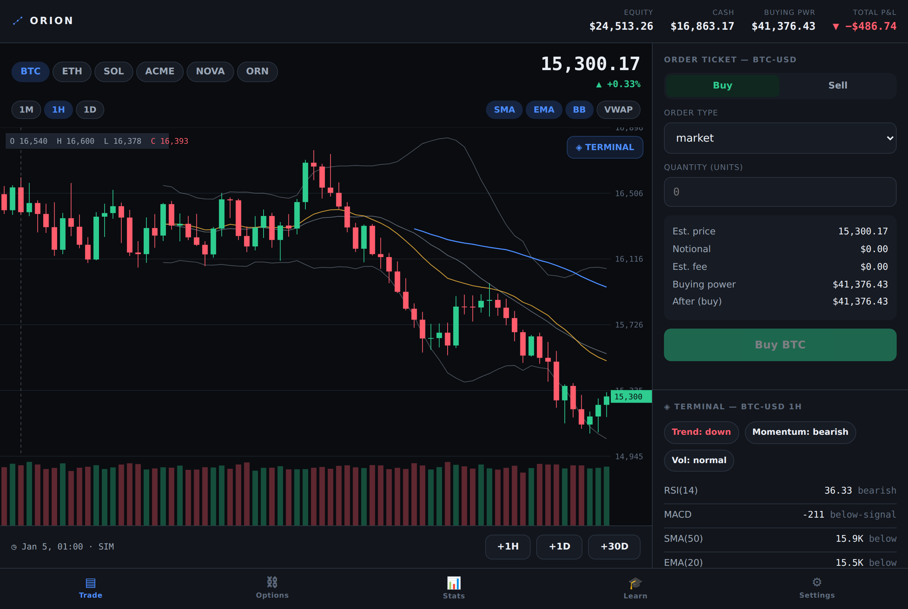
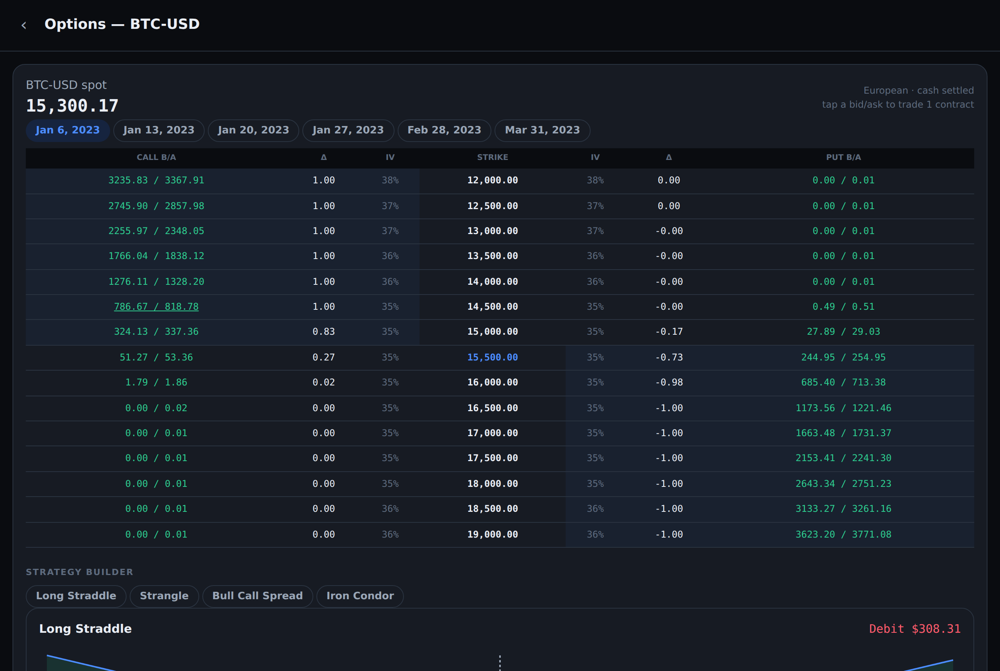
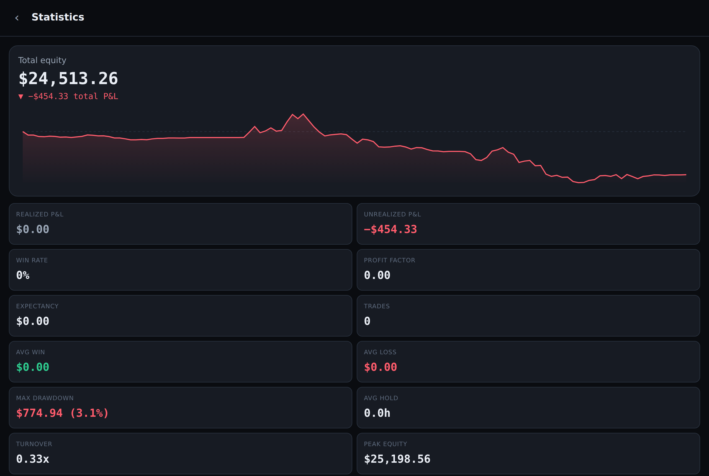

# ORION

> A high-fidelity market trading simulator for stocks and crypto, driven by real
> historical data. Study real charts, control the flow of time, and trade into an
> unknown future — spot, options, and multi-leg strategies — with brokerage-grade
> accounting and zero look-ahead.

ORION is a single-user, self-directed trading sandbox. You fund a simulated
bankroll, analyze the chart *as it stands now*, and place orders that behave like
real ones. You advance the entire simulated world by **+1h / +1d / +30d**. There
is no win/lose and no game-over: going broke only blocks *opening* new positions
until you recover or reset — you can always manage what you hold.

**ORION is an educational simulation using historical and/or delayed market data.
It is not a brokerage.** This disclosure lives in onboarding, About, and the legal
screen; it never intrudes on the live trading UI.

---

## Repository layout

```
sim/        The simulation core — pure, framework-agnostic, deterministic
            TypeScript (spec §3). This is the heart of the product: the UI is a
            thin renderer over it. Fully unit-tested, runs offline, no UI deps.
app/        A WORKING web client over the engine — trading terminal, options
            chain + strategy builder, time-scrubbing, stats, learning track,
            settings. Verified end-to-end in a headless browser.
design/     Design-system tokens (spec §2): color, spacing, radius, elevation,
            typography (tabular numerals), motion/springs, haptics — the source
            of truth every client consumes.
```

## The app

A complete, running ORION client lives in `app/` — built as a thin renderer over
the engine, so the chart and the book can never disagree and no UI path can
introduce look-ahead.

| Trade terminal | Options + strategy | Statistics |
|---|---|---|
|  |  |  |

```bash
cd app && npm i -D esbuild && npm run build && npm run serve   # http://localhost:5173
```

### Live site (GitHub Pages)

The built app is committed to [`docs/`](docs/) and is served by GitHub Pages
**without any build step or CI** once Pages is pointed at that folder:

> **https://blindmo.github.io/Orion/**

**One-time setup** (repo **Settings → Pages**): set **Source = "Deploy from a
branch"**, **Branch = `claude/orion-trading-simulator-paatT`**, **Folder =
`/docs`**, then **Save**. The site goes live in a minute or two. Re-publish after
changes with `cd app && npm run build:docs` and commit `docs/`.

A GitHub Actions workflow (`.github/workflows/pages.yml`) is also included for an
automated build-and-deploy; use it instead if Actions is enabled for the repo.

It covers the full loop: candlestick charting with indicators and the Terminal
scanner, an institutional order ticket (market/limit/stop/stop-limit/trailing),
player-controlled time with animated scrubbing, the options chain + multi-leg
strategy builder with payoff diagrams, the stats dashboard, the gated learning
track, settings (incl. Live mode + the Help toggle), and onboarding disclosure.
Sessions persist via a deterministic action log and replay on reload.

## What is built here

This repository delivers the **complete simulation engine** — step 1 of the
spec's build order (§14) and the standalone module the spec mandates (§3) —
production-grade and verified, plus the design-token foundation. The engine is
the substrate every screen renders over; it is where the spec's *non-negotiable*
correctness constraints (§13) live, and it is fully exercised by an automated
test suite (100 tests) and a runnable end-to-end demo.

### Engine capabilities (`sim/`)

| Area | Spec | Status |
|---|---|---|
| Exact decimal money math (fixed-point bigint) | §13.5 | ✅ tested |
| Seeded PRNG / determinism | §13.2 | ✅ tested |
| Trading calendars (US-equity sessions, holidays, DST; crypto 24×7) | §5 | ✅ tested |
| OHLCV data layer with **hard no-look-ahead guard** | §4, §13.1 | ✅ tested |
| Indicators: SMA, EMA, VWAP, Bollinger, RSI, MACD, Stochastic, ATR, OBV, S/R | §9 | ✅ tested |
| Global clock + advancement (+1h/+1d/+30d), bar-by-bar event processing | §5 | ✅ tested |
| Orders: market, limit, stop, stop-limit, trailing-stop; DAY/GTC | §6 | ✅ tested |
| Spread, size slippage, partial fills, fees, short selling + borrow cost | §6 | ✅ tested |
| Portfolio: 1:1 mark-to-market, avg cost, realized/unrealized, buying power, bankruptcy | §7 | ✅ tested |
| Options: BSM pricing + Greeks, **BAW American**, pluggable vol surface | §8 | ✅ tested |
| Option chain builder; multi-leg strategies + payoff analysis | §8 | ✅ tested |
| Option expiry / exercise / assignment settlement | §8 | ✅ tested |
| Detailed analytics: win rate, profit factor, expectancy, drawdown, turnover… | §12 | ✅ tested |
| Terminal indicator scanner (analytical + educational) | §9 | ✅ tested |
| Options learning track: 9 modules, quizzes, progress, checkpoint unlocks | §10 | ✅ tested |
| Live mode hook (crypto real-time fills) | §5 | ✅ engine-side |

### Two hard rules, enforced in code

1. **No look-ahead.** `BarSeries` only ever exposes bars that have *fully closed*
   at or before `clock.now`; `atGuarded()` throws a `LookaheadError` in dev if
   anything reaches past it. Market orders fill at the **next available bar**,
   never the last close.
2. **1:1 accounting integrity.** Every position is marked at the instrument's
   current simulated price on every tick. A test asserts position marks equal the
   chart's printed price at random clock positions (§13.3).

### Help gating (pure-simulation mode)

Per product direction, **all instructional content is gated behind a single
setting** (`settings.helpEnabled`). With help **off**:
- the Terminal returns bare analytical readings — **no teaching callouts**;
- the learning track is entirely unavailable (`getCurriculum()` → `null`).

ORION then behaves as a pure, no-hand-holding simulation. With help **on**, the
Terminal explains *why* each reading matters and links to the relevant lesson.

## Run it

Requires Node 22+ (uses the built-in test runner and native TypeScript
type-stripping — **no install step, no network**).

```bash
cd sim
npm test          # 100 unit tests
npm run typecheck # strict tsc --noEmit
node --experimental-strip-types examples/demo.ts   # end-to-end session
```

Example demo output: buys spot BTC on the next bar, prices an ATM call off the
live vol surface, advances +30 days (resolving theta decay and expiry along the
way), runs the Terminal scan, and prints the full analytics report.

## Using the engine

```ts
import { createDemoWorld, analytics, scan } from "@orion/sim";

const w = createDemoWorld({ settings: { startingCash: 100_000 } });

w.submit({ target: { kind: "spot", symbol: "BTC-USD" }, side: "buy", qty: 0.5, type: "market" });
w.advanceHour();                 // fills on the next bar — no look-ahead
console.log(w.equity().toFixed(2));

const report = analytics(w);     // §12 metrics
const read   = scan(w, "BTC-USD"); // Terminal scanner (teaching gated by helpEnabled)
```

The entire world state (clock, cash, positions, orders, settings, learning
progress) is plain serializable data — persist it and restore to survive
restarts; `world.reset()` wipes cleanly (§11).

## Client (planned, design-ready)

The mobile client (React Native New Architecture + Reanimated 3 + Skia, per §3)
renders over this engine: GPU candlestick charts with the Terminal icon, an
institutional order ticket, the options chain and strategy builder, time-advance
scrubbing animations driven by `advance({ onTick })`, the stats dashboard, and
Settings → Learn. Visual language and motion are defined in `design/tokens.ts`.
See `docs/` for the architecture notes.
